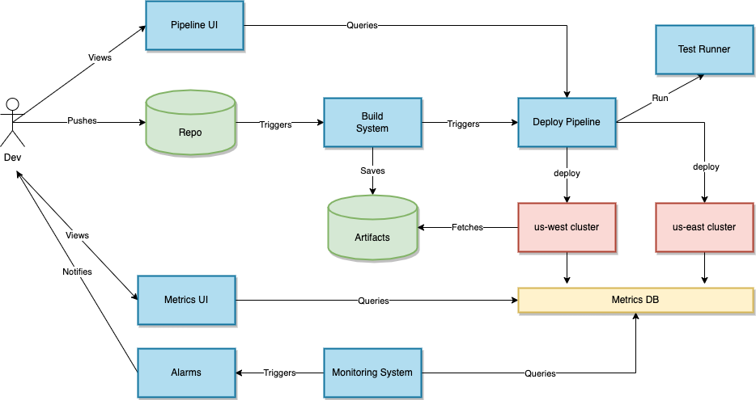
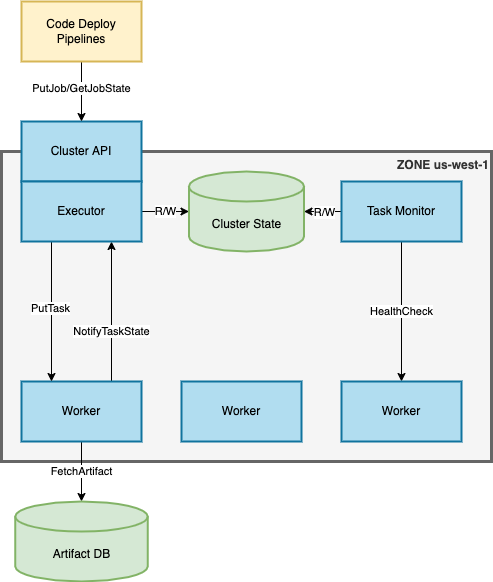
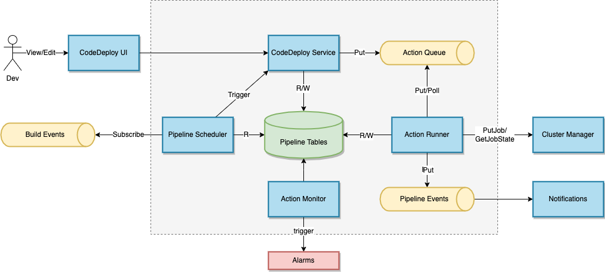

Design a fast, global code deployment system.

# Overview



## Clusters



* A cluster is set of machines in a zone. 
* A cluster is managed by a cluster manager.
* Clusters execute jobs. A job consists of a set of tasks. Each task is a process running on a host.
* A job is defined by a JobSpec.
* A JobSpec contains a target and resource requirements
* A target is a tuple containing a commit hash and a build target. e.g. "master://foo_service:main"
* Resource requirements include things like the number of hosts, networking, compute, storage capacity, etc.
* A task daemon on each host manages tasks. It provides a task management API used by the cluster manager and notifies the cluster manager of state changes.
* A separate monitoring job keeps tabs on running tasks and notifies the cluster manager of failures

```
Job URLs identify jobs
job://<region>/<zone>/<job name>

Task URLs identify tasks
task://<region>/<zone>/<job name>/<task ID>

message JobSpec {
    name string
    target string
    reqs JobReqs
}

message JobReqs {
    hosts int
    vcpus int
    storage StorageSpec 
    networking NetSpec
    // etc etc.
}

service ClusterManager {
    PutJob(JobSpec) -> JobId
    ListJobs() -> [(JobId, name, state)]
    SetJobState(job_id, state)
    GetJobState(job_id)
}

service TaskDaemon {
    PutTask(JobSpec) -> task_id
    SetTaskState(task_id, state)
    GetTaskState(task_id)
}

// Cluster tables
table Jobs (
    job_id string
    name string
    spec blob
    state (PENDING | RUNNING | DONE | ERROR)
) PRIMARY KEY (job_id)

table Tasks (
  task_id string
  job_id string
  host_id string
  state (PENDING | RUNNING | DONE | ERROR)
) PRIMARY KEY (task_id)

```


## Deployment Pipelines



* A deployment pipeline is an abstraction for deploying software in a sequence of stages.
* Each pipeline has a schema describing the pipeline structure
* A schema is a DAG of nodes. Each node has a unique name, a type, a spec, and upstream dependencies.
  * Example: "run integration tests", "deploy this target to us-east-1 after the tests run", etc.
* Pipelines are triggered by code builds, deployment schedules, or manual deployment actions.
* Pipelines are deployed as a DAG of actions generated from the schema.
* Actions are placed in a queue. Action runner executes the actions by determining what to do, calling any external services, waiting until the action is complete (via polling or notifications), and queuing the next actions to perform.
* Long-running actions like deployments can be executed as a sequence of actions. Example: start the deployment, then poll the deployment state every 30 seconds until the the deployment is complete. The action runner could also subscribe to other systems' notifications to update action state without polling.
* The pipelines UI provides a way to edit and view pipelines.
* Pipelines service provides the pipeline status to the UI. Some status items are stored in pipelines tables (e.g. when this deployment finished). Other status items may be fetched from downstream services (e.g. whether a job is currently healthy). Some may be cached.

### Example Pipeline Schema
```
name: FooService
owner: foo_team
schema: [
    {
        "name": "Code Build",
        "type": "build",
        "build_targets": [
            "//repo/foo_service:main",
            "//repo/foo_service:tests",
        ]
    }
    {
        "name": "Service Tests",
        "type": "test",
        "test_target": "//repo/foo_service:tests",
    },
    {
        "name": "us-east-1 deployment",
        "type": "job",
        "spec": "//repo/foo_service/specs:north_america"
    },
    {
        "name": "eu-west-1 deployment",
        "depends_on": ["us-east-1 deployment"],
        "type": "job",
        "spec": "//repo/foo_service/specs:eu"
    }
]
```

### Interfaces and Tables

```
service PipelinesService {
   CreatePipeline(schema)
   ListPipelinesByOwner(owner)
   GetSchema(pipeline_id)
   PutSchema(pipeline_id, schema)
   GetState(pipeline_id) -> List[SchemaNodeState]
}


// Placed in action queue
message Action {
   pipeline_id string
   schema_node_name string
}

// Used by ActionRunner to translate schema nodes to actions
interface ActionPlanner {
   Plan(schema) -> ActionDAG
}

interface ActionDAG {
    GetStart() ActionNode
    FindNode(schema_node) ActionNode
}

interface ActionNode {
    Type() ActionType
    Params() ActionParams
    GetAction() -> Action
    GetDependencies() -> List[ActionNode]
    GetNextActions() -> List[ActionNode]
}

table Pipelines (
   pipeline_id
   name 
   owner
   created_at
   state
) PRIMARY KEY (pipeline_id)

table Schemas (
   pipeline_id
   version
   state (draft/active/inactive)
   schema  (blob)
) PRIMARY KEY (pipeline_id, version)

table ActionState (
   pipeline_id
   schema_node
   created_at
   last_update
   state  (PENDING, IN_PROGRESS, FINISHED, ERROR)
   error_message
) PRIMARY KEY (pipeline_id, (schema_node, created_at))
```
