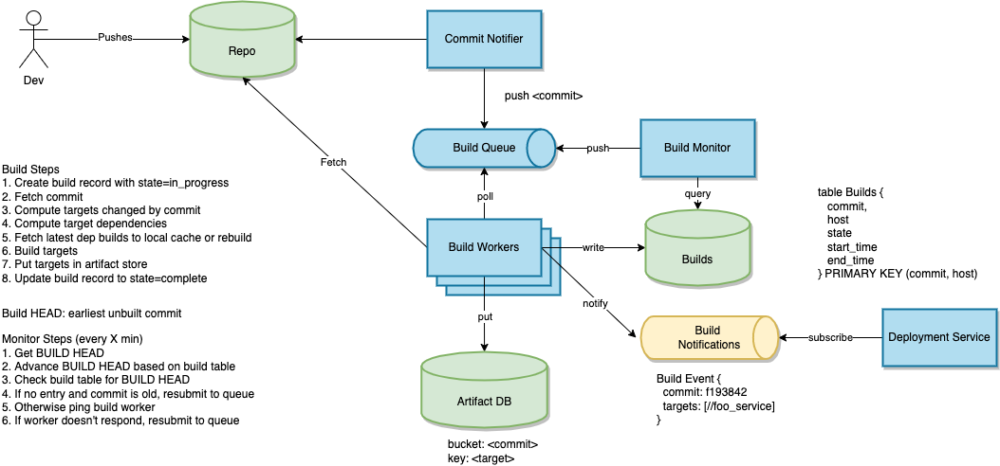

Design a global code deployment system.

# Overview


Definitions
* Target: A single build target in the repository. A target can be built to generate a build artifact (executable/library). It is identified by a path of the form `//folder/subfolder:name`
* Artifact: A target built at a particular commit.
* Zone: A single datacenter within a geographical area. e.g. us-east-1
* Cluster: A set of machines within a single zone.
* Job: A program running on a cluster. A job may have multiple processes running across multiple hosts.
* JobSpec: A specification for a job. Consists of a target and a set of resource requirements.
* Task: A single process running as part of a job.
* Pipeline: An abstraction for deploying software in a sequence of stages.
* Pipeline schema: A specification for a pipeline. Consists of a sequence of stages. Each stage has a type and parameters. Stages may depend on other stages. (e.g. "stage 1: run tests" "stage 2: deploy to us-east-1 after tests pass")

## Build System



The build system generates artifacts for each commit. These artifacts can then be retrieved by cluster hosts when a job is deployed.

## Clusters


Clusters run jobs. Each cluster is managed by a cluster manager. The manager provides an API to configure and submit jobs. Jobs are defined by a JobSpec and executed as a collection of tasks running on worker host. Each host runs a task daemon which monitors tasks and handles requests from the manager. When a task daemon receives a task, it fetches the target artifact from the artifact store, starts the task, then notifies the manager of the task state changes. A separate monitoring job keeps tabs on running tasks and notifies the manager of failures.

```
Job URLs identify jobs
job://<region>/<zone>/<job name>

Task URLs identify tasks
task://<region>/<zone>/<job name>/<task ID>

message JobSpec {
    name string
    target string
    reqs JobReqs
}

message JobReqs {
    hosts int
    vcpus int
    storage StorageSpec 
    networking NetSpec
    // etc etc.
}

service ClusterManager {
    PutJob(JobSpec) -> JobId
    ListJobs() -> [(JobId, name, state)]
    SetJobState(job_id, state)
    GetJobState(job_id)
}

service TaskDaemon {
    PutTask(JobSpec) -> task_id
    SetTaskState(task_id, state)
    GetTaskState(task_id)
}

// Cluster tables
table Jobs (
    job_id string
    name string
    spec blob
    state (PENDING | RUNNING | DONE | ERROR)
) PRIMARY KEY (job_id)

table Tasks (
  task_id string
  job_id string
  host_id string
  state (PENDING | RUNNING | DONE | ERROR)
) PRIMARY KEY (task_id)

```


## Deployment Pipelines


### Example Pipeline Schema
```
name: FooService
owner: foo_team
schema: [
    {
        "name": "Code Build",
        "type": "build",
        "build_targets": [
            "//repo/foo_service:main",
            "//repo/foo_service:tests",
        ]
    }
    {
        "name": "Service Tests",
        "type": "test",
        "test_target": "//repo/foo_service:tests",
    },
    {
        "name": "us-east-1 deployment",
        "type": "job",
        "spec": "//repo/foo_service/specs:north_america"
    },
    {
        "name": "eu-west-1 deployment",
        "depends_on": ["us-east-1 deployment"],
        "type": "job",
        "spec": "//repo/foo_service/specs:eu"
    }
]
```

### Interfaces and Tables

```
service PipelinesService {
   CreatePipeline(schema)
   ListPipelinesByOwner(owner)
   GetSchema(pipeline_id)
   PutSchema(pipeline_id, schema)
   GetState(pipeline_id) -> List[SchemaNodeState]
}


// Placed in action queue
message Action {
   pipeline_id string
   schema_node_name string
}

// Used by ActionRunner to translate schema nodes to actions
interface ActionPlanner {
   Plan(schema) -> ActionDAG
}

interface ActionDAG {
    GetStart() ActionNode
    FindNode(schema_node) ActionNode
}

interface ActionNode {
    Type() ActionType
    Params() ActionParams
    GetAction() -> Action
    GetDependencies() -> List[ActionNode]
    GetNextActions() -> List[ActionNode]
}

table Pipelines (
   pipeline_id
   name 
   owner
   created_at
   state
) PRIMARY KEY (pipeline_id)

table Schemas (
   pipeline_id
   version
   state (draft/active/inactive)
   schema  (blob)
) PRIMARY KEY (pipeline_id, version)

table ActionState (
   pipeline_id
   schema_node
   created_at
   last_update
   state  (PENDING, IN_PROGRESS, FINISHED, ERROR)
   error_message
) PRIMARY KEY (pipeline_id, (schema_node, created_at))
```
