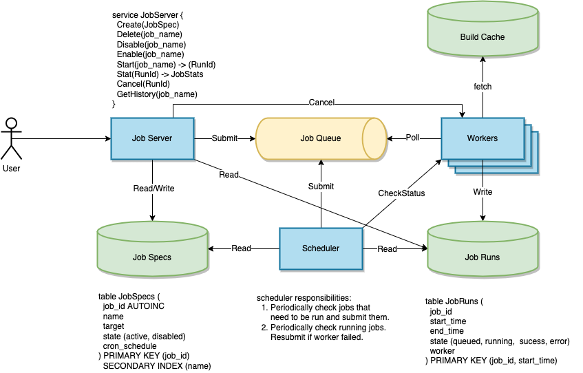

# Job Server

Design a job server.

## Features

* Users can create jobs that run executables built by a build system.
* Users can submit one-off job runs.
* Users can create a job schedule to run a job periodically.
* Users can check the status of running jobs and cancel them.
* Scales up to 1000s of jobs.

## Design

