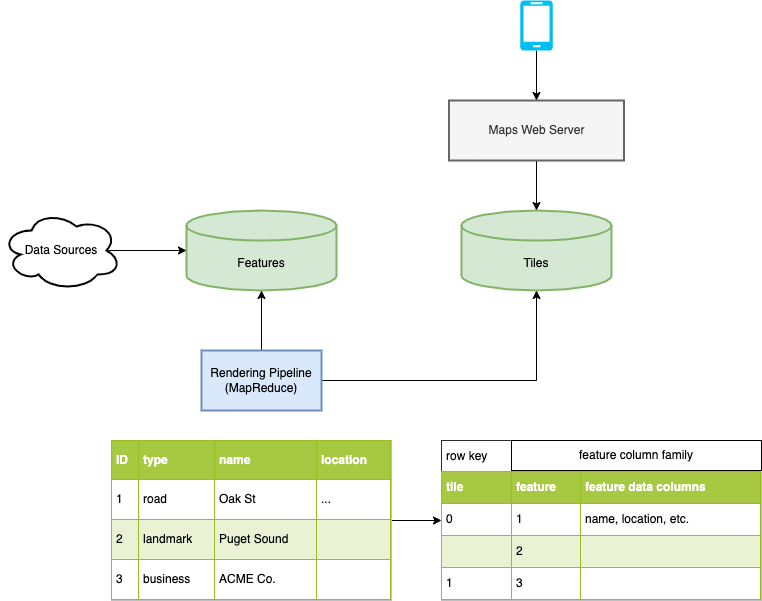

# maps

Design a web-based maps app.

## Features

* View roads, businesses, landmarks, etc.
* Zoom in/out to see features at different resolutions

## Overview

* Features and tiles stored in hBase/BigTable
* Features include roads landmarks, businesses, etc. Each has an ID and other columns storing name, location, etc.
* Location could be a set of path segments for roads or box/polygon for landmarks.
* Tiles include all features in a square on the map.
* Tiles are assigned numbers. Consider assigning numbers to colocate nearby tiles on the same server. This reduces high latency variance from read fanout.
* Handle zoom in/out by rendering tiles at different resolution levels. 1 = whole world, 10 = city block, etc. Can be added as a tile key prefix.
* Could also use client side feature filtering at some resolutions, but you want to avoid shipping too much data to the client when zoomed out.
