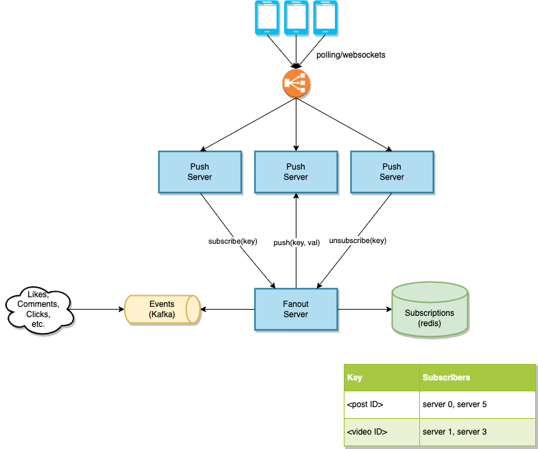

# Real Time Notifications

Design real time notifications for a website. Example: comment/like notifications

* ~10s of MBs/sec of source events (twitter was under 50MB/sec in late 2010s)
* ~10-100k active clients per data center
* 1-10 notifications/sec/client.
* ~512 bytes/notification. Batched into a few KBs per push. ~1KB/sec/client
* 10-20 active subscriptions/client (a few pages of feed items)
* ~1000s of client connections per push server. ~10s of push servers
* Feed server write load is worst case 10 * 100MB/sec = 1GB/sec.
* More realistically 1KB/sec/client * 4096 clients/server * 16 servers = ~128MB/sec
* ~1 subscription change/sec/client. ~64K/sec/cluster for peak traffic with 16 push servers 4K connections each. ~512KB/sec with 4 byte keys and server IDs. Doable.
* Shard fanout servers by kafka partition for more scale.
* Fanout server could be removed at the expense of ~16x higher read load on kafka broker(s). ~1GB/sec. Doable.
* Scale up to millions of clients with another layer of fanout servers
