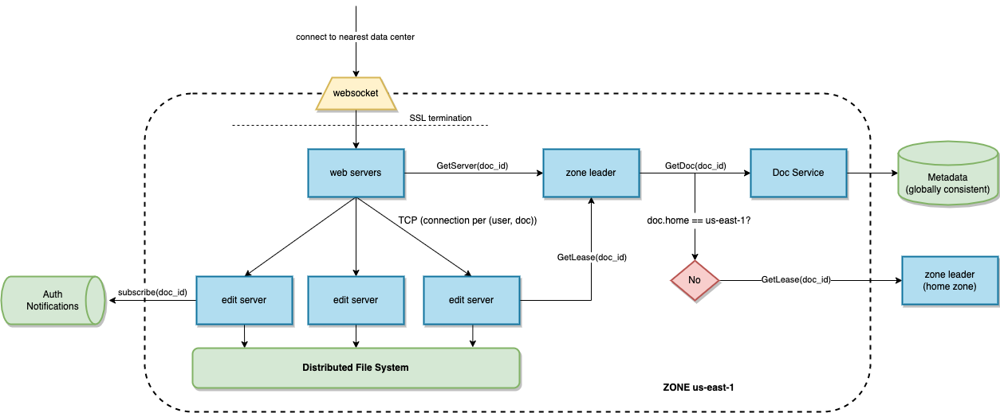

# webdocs

Design a web-based, real-time document editing system.

## Features

* Real time word editing
* Multiple users can view and edit docs simultaneously
* Documents can be organized into folders
* Up to ~100 concurrent viewers per doc
* Millions of users
* Permissions can be managed at the folder level and document level

## Overview

## Edit Servers

